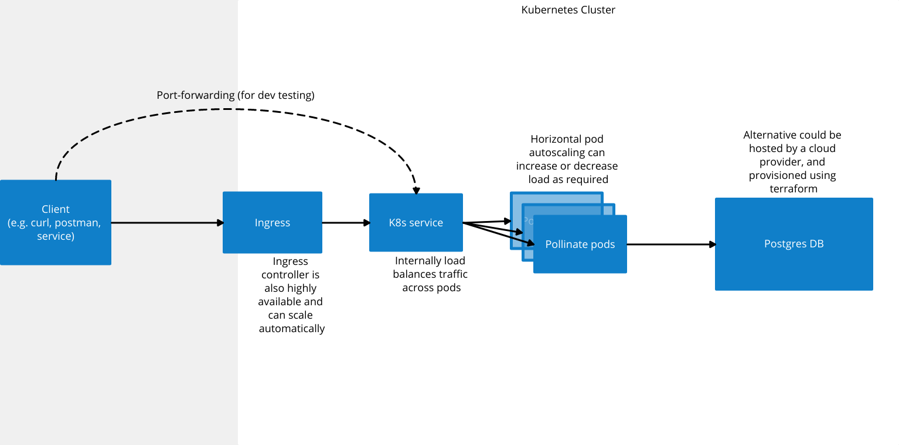

Pollinate Tech Assignment
=========================

The objective of this exercise is to design, deploy and provision a highly available service.  A high-level architectural diagram of the intended deployment will look like this:

Assignment
----------

*1. Create a proof of concept for the following: Create an application with simple API that will be used to submit a curl command (curl -X POST http:// <someip> /app ) that will insert the date-time stamp into your database.*

I have written a small golang REST API to handle this.

*2. The proof of concept should consist of a single web-application and a single database*

The application is capable of taking properties of a DB connection as environment variables to build a custom connection
string.  Thus the application can store timestamp in the postgres DB.  Additionally, I've added a /display endpoint to
retrieve all timestamps back from the DB to ensure it is working correctly.  Note that paging hasn't been setup for this
endpoint so it should only be used in development on small DBs.  We can remove the endpoint or only enable if via feature
flag if required.

*3. Create a GitHub project for this assignment*

The code for the above is available at https://github.com/maplesond/pollinate

*4. Automation the provisioning your database node and web node with the API you created.*

I have created a helm chart to handle deployment to a K8s cluster.  The postgres DB can be deployed alongside, or the SRE
can configure the helm release to use an existing postgres DB if required.

*5. A readme file must be populated with your git project detailing your solution and how to run it.*

This is the README :)  Step to run and deploy are described in the section below.

*6. Provide details of your high-level design that would meet the requirements outlined above. This design must be submitted 24 hours before the interview scheduled via pdf and must show a logical design.*

I will generate a PDF of this markdown file and provide it as an email attachment.

Building and Running the app
----------------------------

I have created a [Makefile](Makefile) to assist with building and running the application in various ways.  You can use
this to copy the suggested command lines, or install [Make](https://www.gnu.org/software/make/) on your system and use `make <target>` to run any of the commands
directly.  Summary of targets is described here:

*build*

Creates an executable called "pollinate" in the base directory of this repo.  Because this is a golang application you
will need to install [golang](https://go.dev/) on your system for this to work.  I've assumed the latest version of golang,
so you will need to install v1.19 or later.

*run*

If the pollinate executable is not already present, then it will build it first, then it will start the REST API locally.  It will
take in try to connect to an existing postgres DB in my environment by default, therefore it is likely you will need to
add some environment variables to connect to an existing postgres DB in your environment.  Required environment variables
are:

- DB_HOST
- DB_PORT
- DB_USERNAME
- DB_PASSWORD
- DB_NAME

Likely you will also need to create a new DB in your postgres instance.  To help with this an [sql file](db_setup.sql) is
provided in this directory.  To use it first log into your postgres instance and postgres user and run the commands in the file
to create the pollinate database and user.  Adjust values as required and keep in sync with the environment variables above. 

After this is all setup, running this make target will start the service on port 8000.  You can adjust this by using another
environment variable called "PORT".  There are 3 endpoints setup:

- /app (POST) - this will create a timestamp in the postgres DB
- /display (GET) - retrieves all timestamps from the DB
- /metrics (GET) - gets current prometheus metrics

*build-docker*

In order to run in kubernetes, or easily in other environments that have a container runtime, then we should create a container
image.  I'm assuming docker for simplicity.  To run this command you will need [docker](https://docs.docker.com/) installed 
on your system.  Additionally, you will likely want to modify the tag specified here so you can publish to your own space
in dockerhub.

*run-docker*

To validate the docker container is running correctly you can use this target.  It will assume port 8000.  If you wish
to use another port in the container or on your local system you should adjust the command as necessary.  If the docker image
is not already built this make target will build it for you first.  When running you can access it in much the same way
as described in the "run" target above.

*publish*

Builds the docker image if necessary, and then pushes the built docker image to dockerhub.

*deploy*

Likely you will want to not run this target directly.  It assumes you already have a K8s cluster setup and are using the
correct kube-context.  Setting up a cluster is out of scope for this document.  It also assumes you have [kubectl](https://kubernetes.io/docs/tasks/tools/#kubectl) and [helm](https://helm.sh/docs/intro/install/) installed on your system.    

This target also assume you want to deploy
using default configuration.  If you wish to change this you will need to create a new helm values file change details
as required and include this in the helm upgrade command.  Full details of possible options are out of scope of this
document by I can discuss options, such as adding an ingress or dealing with secret values if needed.

Questions and Tasks
-------------------

*1. Explain with as much detail as you can of your high-level design and explain why that would meet the requirements outlined above.*

From a coding perspective my high level design is to create a simple go web app which uses a postgres DB backend and prometheus library for 
generating custom metrics.  I have chosen to deploy the application to a kubernetes cluster as this provides a platform for
scaling the application across many nodes.  To do this I created a dockerfile to provide a description of how to "containerise"
the application, allowing it to run on any system with a suitable container runtime, such as kubernetes cluster.  However,
in order for users to interact with the container in kubernetes a suitable K8s manifest must be created as well.  To do
this I created a helm chart which would allow SREs to easily deploy the container to different environments with small configuration
changes.  Furthermore the helm chart has additional features that would allow an SRE to describe an ingress for the application
and control how it might scale to multiple replicas.  The helm chart also has a dependency on the bitnami postgresql helm chart allowing us to 
deploy both the web app and the db side by side should we wish to.

*2. Provide details of your web API that will be used to submit a curl command (curl -X POST http:// <someip> /app) that 
will insert the DateTime stamp into your database. The api code should be well documented.*

If run locally it is possible to record a timestamp in the DB by hitting the http://localhost:8000/app endpoint.  If deployed
to a cluster then the helm chart will return how to access to webapp after installation.  If no ingress is specified then
likely it will be necessary to use port-forwarding, in which case the URL to add the timestamp will be similar (or identical)
to that above, depending on how port-forwarding is configured.

*3. In addition, provide any automation for your backup/restore process you would implement.*

In my environment snapshots of the entire filesystem are configured automatically on an hourly / daily and weekly basis
going back a month.  In worst case if the directory is lost or corrupted we can restore any of those snapshots by taking 
the DB offline, copying back the snapshot data, then reinstantiating the DB. 

In a production environment we could, and probably should, use a cloud providers DB solution.  This will come with its own
backup and restore procedure and is normally very easy to invoke by recreating a new DB from the backup.  This will then
likely involve some change of the connection string described in the helm release to point at the new DB.

In both cases no additional automation is required for backing up the data.  The restoration process could be automated
but I haven't done it hear as it is a relatively large amount of work to implement without affecting a running production
instance.

4. Provide details of your Persistency Layer, with details of your cluster setup and
   configuration.

In my case I am running a standalone postgres instance with one active primary node.  The helm chart allows for setting 
up a postgres cluster, with read replicas with a small amount of tweaking to the configuration.  This allows for failover 
to the read replica and promote that to primary if the primary has any issues.  In addition, it allows services that only
need to read data to target the read replicas directly, thus distributing the load better.

The system backing this is a amd64 VM, which has NFS mounts to them backed by a ZFS NAS.  The ZFS datasets used 
for this mount is regularly snapshotted as described above.  The data is running on a pool of mirrored SSDs, allowing one 
to fail without affecting the integrity of the data.

In production we would likely use a cloud providers solution in which case the details are often hidden from us.  Although behind the scenes it is likely the postgres cluster setup would be similar to the self-hosted K8s deployment.

5. If you consider any Load Balancer or queuing service to be used, please be ready to explain the reasons and your suggested configurations of each.

I am using metallb as a load balancer in front of the ingress controller.  Additional K8s internal service setup automatically
load balances all traffic to that app across however many instances are deployed.  In production we would use a cloud 
providers load balancer to front the ingress.  Load balancing in cluster would be handled by K8s in the same way.

6. Please consider monitoring and maintainability

I have added prometheus metrics to the web app so we can track the number of requests coming in.  Also be default we
can see how many requests with error codes are returned.  This could be a key indicator which we could use in combination
with a prometheus sever and an alerting service such as pager duty to address issues before they impact users too badly. 

Additionally, we would setup blackbox probing of the endpoint to ensure external traffic is always reaching the app.

K8s tracks the health of application itself using the liveness and readiness probes.  These are configured by default in
the helm chart to target the /metrics endpoint.  If a 200 is returned then it considers the app alive.  With further development
we should create defined health endpoints which could also probe the DB to ensure it is able to respond correctly as well. 

We should also ensure the log data is shipped to a logging solution.  Loki is a good, lightweight, self hosted option,
or we could use a service like splunk if we wanted to use a SaaS solution.

7. Please explain how elastic your service is, what would be trigger points and how the scale up or down would actually work.

The Horiztonal pod autoscaler would allow the service to automatically scale up and down based on cpu and memory usage of 
the pods.  By default this is set to 80% of a single vCPU, although this value can be customised in the helm chart.  The HPA
is configured by default to run a minimum of 2 pods, scaling up to 10 based on CPU usage.

The postgres DB can't scale on my system, although there is sufficient capacity to handle a decent load.  If this were a 
production system we would use a cloud providers offering which allows for increasing the cores and memory of the system.  
Alternatively we might consider a distributed DB such as Cassandra DB or which allows for multiple active nodes, sharding and replication, or a PaaS offering such as CosmosDB.

